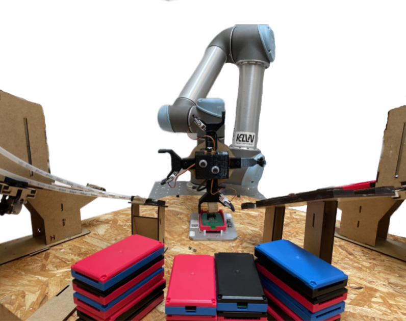

# P2-Project code for Group 261
  

This repository contains the codebase for the 2nd semester project by Group 261. The semester focused on robot manipulators and specifically the UR5 for the respective project. 
The ambition of the project was to reduce the environmental footprint of the robot. The idea was to assemble a dummy phone with minimum stops to decrease required accelerations and decelerations, which was found to
cause big energy spikes. Therefore a gripper consisting of four individual grippers for each component of the dummy phone was created. The individual grippers was assembled in a circular shape with equal distance
to the center. This allowed the robot to pick up all the components in a continous rolling motion, which indeed was a very satisfying thing to watch!
Although the effect on the environmental footprint were minimal, the continous flow in the pick showed great potential in regard to throughput. However, this would require some tweaking and improvements to the
current robot trajectory as it currently is only as fast as the "classical" approach. Nevertheless, we urge you to take a look at the video "20 phones assembled 100 % success" in the YouTube playlist found by
following the link [P2-Playlist](https://www.youtube.com/playlist?list=PLvF0YaCHe3KkmQyWYJX_KTgWdvqXj8dY-).

## Code overview
The code setup consist primarily of the 4 parts:
1.  **Customer GUI** 
2.  **Operator GUI**
3.  **Central Hub**
4.  **Dispenser Code**

The central hub functions as the link between the robot, the dispensers, the customer GUI and the operator GUI. It takes orders from the customer GUI through a TCP connection and sends the respective order to the arduino controlling
the dispensers over a serial connection. When receiving an acknowledgement from the arduino the central hub starts an appropriate program on the UR5 also through a TCP connection through RoboDK. Lastly, component
lists are updated, which the operator GUI uses to alert the operator if the cell is running out of components. The GUI's has also been shown in the [P2-Playlist](https://www.youtube.com/playlist?list=PLvF0YaCHe3KkmQyWYJX_KTgWdvqXj8dY-). 

Beside the physical cell, a digital twin of the cell has been set up in RoboDK to allow for offline development and testing ideas before running them on the actual robot cell. Together, with a range of helper scripts
the programs could be generated automatically based on the kinematics learned thorughout the semester. 

## Contributors
This project was developed by group 261 on Aalborg University, Robot Technology at 2nd semester.

<section id="sec_contributors">
<table>
  <tr> 
    <td align="center"><a target="_blank" rel="noreferrer noopener" href="https://github.com/signeskuldbol"> <b>Signe Møller-Skuldbøl</b></a> <a href="gttps://github.com/signeskuldbol" title="">👧</a></td>
    <td align="center"><a target="_blank" rel="noreferrer noopener" href="https://github.com/thor2643"> <b>Thor Iversen</b></a> <a href="gttps://github.com/thor2643" title="">👨‍🌾</a></td>
    <td align="center"><a target="_blank" rel="noreferrer noopener" href="https://github.com/silasjensen2001"> <b>Silas Jensen</b></a> <a href="gttps://github.com/silasjensen2001" title="">🤠</a></td>
  <td align="center"><a target="_blank" rel="noreferrer noopener" href="https://github.com/Magnusdar"> <b>Magnus Darø</b></a> <a href="gttps://github.com/Magnusdar" title="">🐻</a></td>
  <td align="center"><a target="_blank" rel="noreferrer noopener" href="https://github.com/TheRobotSkier"> <b>Emil Hausberger</b></a> <a href="gttps://github.com/TheRobotSkier" title="">😎</a></td>
  <td align="center"><a target="_blank" rel="noreferrer noopener" href="https://github.com/bordlampe123"> <b>Benjamin Jørgensen</b></a> <a href="gttps://github.com/bordlampe123" title="">😎</a></td>

  </tr>
</table>
